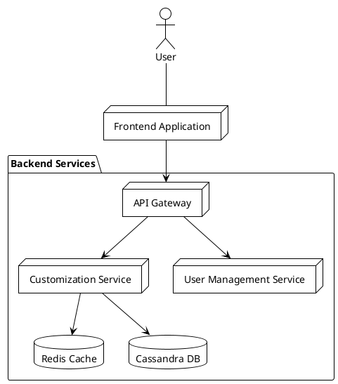

# High-Level System Design: Customization Repo

## Overview

This system enables dynamic customization of application features and UI elements based on user roles, preferences, or organizational requirements. The architecture is modular, scalable, and leverages Cassandra DB for persistent storage and Redis for caching customization data.
Early adoption of Server Side UI (SSUI) is considered to enhance the user experience by allowing dynamic UI changes without requiring client-side updates.

---

## Main Components

### 1. Customization Service

- **Responsibility:** Core logic for managing customizations (feature toggles, UI changes, etc.).
- **Interactions:** 
  - Reads/writes customization data from/to Cassandra DB.
  - Uses Redis cache to speed up fetching frequently accessed customization data.
  - Exposes RESTful APIs for CRUD operations on customization entities.

### 2. Cassandra DB

- **Responsibility:** Stores customization data, *maybe audit logs?*.
- **Features:** Highly scalable, distributed, suitable for large volumes of data and high availability.

### 3. Redis Cache

- **Responsibility:** Caches customization data to reduce latency and database load.
- **Features:** In-memory, fast read/write, supports TTL for cache invalidation.

### 4. Frontend Application

- **Responsibility:** Dynamic UI rendering based on customization data.
- **Interactions:**
    - Fetches customization settings.
    - Adapts UI components according to received configuration.

---

## Data Flow

1. **User Login:** User authenticates via API Gateway → User Management Service.
2. **Customization Fetch:** 
   - Frontend requests customization settings → API Gateway → Customization Service.
   - Customization Service checks Redis cache.
   - If cache miss, fetches from Cassandra DB, updates Redis.
3. **UI Rendering:** Frontend adapts UI based on customization data.
4. **Customization Update:** Admin updates customization via API → Customization Service → Cassandra DB (and updates/invalidates Redis cache).

---

## Extensibility

- **Plugin Architecture:** Support for adding new customization types.
- **Database Abstraction:** Easy switch between supported databases if needed.

---

## Security - **TO BE DISCUSSED!**

- **Authentication:** 
- **Authorization:** 
- **Audit Logging:** 

---

## Diagram

---

## API Documentation

The Customization Service exposes a RESTful API for managing UI customizations. All endpoints are prefixed with `/api/v1/ui-customization`.

| Method | Endpoint                                    | Description                                                       | Request                              | Response                              |
|--------|---------------------------------------------|-------------------------------------------------------------------|--------------------------------------|---------------------------------------|
| GET    | `/{userId}`                                 | Get customization for a specific user                             | -                                    | 200 OK with UICustomization or 404 Not Found |
| POST   | `/`                                         | Create a new UI customization                                     | UICustomization object               | 201 Created with UICustomization or 500 Error |
| PUT    | `/{userId}`                                 | Update an existing UI customization                               | UICustomization object               | 200 OK with UICustomization or 500 Error |
| PATCH  | `/{userId}/components/{componentId}/order`  | Update the display order of a component                           | Query param: newOrder (Integer)      | 200 OK with UICustomization or 500 Error |
| PATCH  | `/{userId}/components/{componentId}/visibility` | Toggle visibility of a component                              | -                                    | 200 OK with UICustomization or 500 Error |
| DELETE | `/{userId}`                                 | Delete UI customization for a user                                | -                                    | 204 No Content or 500 Error           |
| GET    | `/{userId}/components`                      | Get components for a user, optionally filtered by component type  | Optional query param: componentType  | Flux<UIComponent>                     |

---

## Service Implementation: WebFlux vs MVC

### WebFlux (Reactive)
- **Pros:**
  - Handles large numbers of concurrent requests efficiently.
  - Non-blocking I/O, suitable for microservices and cloud-native environments.
  - Better resource utilization under high load.
- **Cons:**
  - Steeper learning curve.
  - More complex debugging and tracing.
  - Not all libraries are reactive-friendly.

### MVC (Imperative)
- **Pros:**
  - Simpler, well-understood programming model.
  - Easier to debug and maintain.
  - Wide library and community support.
- **Cons:**
  - Less efficient under very high concurrency.
  - Blocking I/O may limit scalability.

---

## Notes

- Cassandra DB is used for persistent storage.
- Redis cache is integrated to optimize customization data retrieval.
- Service implementation (WebFlux vs MVC) will be decided based on project requirements and team expertise.
